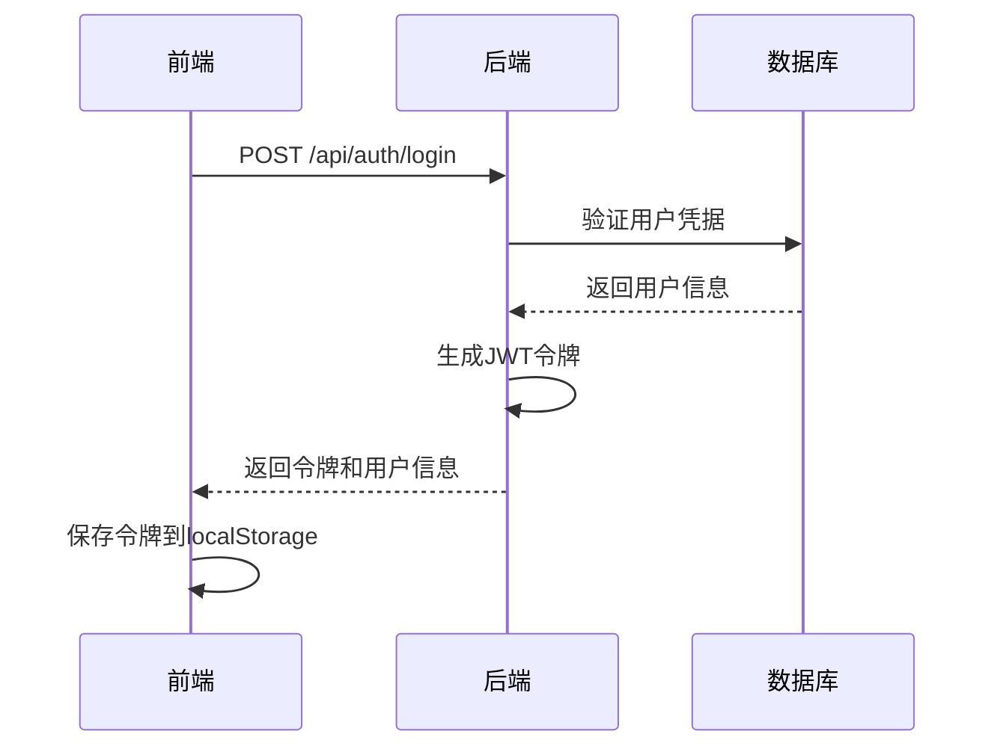
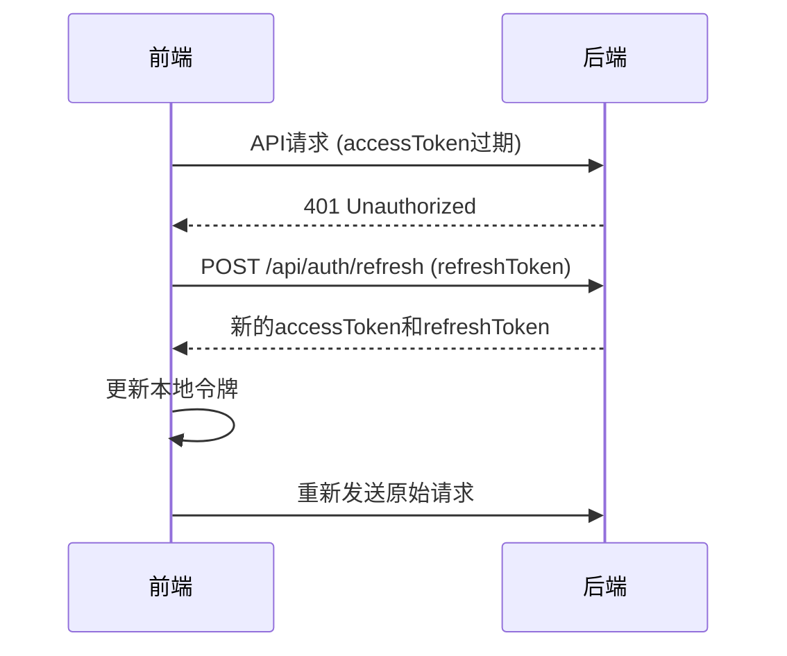

# 前后端对接说明文档

## 🎯 概述

本文档说明了前端Vue.js应用与后端Spring Boot应用的对接方式，包括认证、用户管理、角色权限等功能。

## 🔧 环境配置

### 后端配置
1. **启动后端服务**：确保Spring Boot应用运行在 `http://localhost:8080`
2. **数据库配置**：确保MySQL数据库连接正常
3. **JWT配置**：已配置安全的256位密钥

### 前端配置
1. **环境变量**：
   - 开发环境：`.env.development`
   - 生产环境：`.env.production`
2. **API基础URL**：`http://localhost:8080/api`
3. **WebSocket URL**：`ws://localhost:8080/chat`

## 📡 API接口对接

### 认证相关接口

#### 1. 用户登录
- **接口**：`POST /api/auth/login`
- **请求体**：
```json
{
  "username": "string",
  "password": "string", 
  "userType": "TEACHER" | "STUDENT",
  "rememberMe": boolean
}
```
- **响应**：
```json
{
  "success": true,
  "code": 200,
  "message": "登录成功",
  "data": {
    "accessToken": "string",
    "refreshToken": "string",
    "tokenType": "Bearer",
    "expiresIn": 3600,
    "userId": 1,
    "username": "string",
    "realName": "string",
    "email": "string",
    "role": "TEACHER" | "STUDENT",
    "avatarUrl": "string",
    "department": "string"
  }
}
```

#### 2. 用户注册
- **学生注册**：`POST /api/auth/register/student`
- **教师注册**：`POST /api/auth/register/teacher`
- **请求体**：
```json
{
  "username": "string",
  "password": "string",
  "confirmPassword": "string",
  "realName": "string",
  "email": "string",
  "phone": "string",
  "userType": "TEACHER" | "STUDENT",
  // 学生特有字段
  "studentId": "string",
  "major": "string",
  "grade": number,
  "className": "string",
  "college": "string",
  "enrollmentYear": number,
  // 教师特有字段
  "employeeId": "string",
  "department": "string",
  "title": "string",
  "officeLocation": "string",
  "researchArea": "string"
}
```

#### 3. 令牌刷新
- **接口**：`POST /api/auth/refresh`
- **请求头**：`Authorization: Bearer {refreshToken}`

#### 4. 用户登出
- **接口**：`POST /api/auth/logout`
- **请求头**：`Authorization: Bearer {accessToken}`

### 用户管理接口

#### 1. 获取用户信息
- **接口**：`GET /api/user/profile`
- **权限**：需要认证

#### 2. 更新用户信息
- **接口**：`PUT /api/user/profile`
- **权限**：需要认证

#### 3. 修改密码
- **接口**：`PUT /api/user/password`
- **权限**：需要认证

### 角色特定接口

#### 教师接口
- `GET /api/teacher/students` - 获取学生列表
- `GET /api/teacher/colleagues` - 获取同事列表
- `GET /api/teacher/statistics` - 获取统计信息

#### 学生接口
- `GET /api/student/classmates` - 获取同学列表
- `GET /api/student/teachers` - 获取教师列表
- `GET /api/student/statistics` - 获取统计信息

## 🔐 认证流程

### 1. 登录流程


### 2. 令牌刷新流程


## 🛡️ 安全特性

### 1. JWT双令牌机制
- **访问令牌**：有效期1小时，用于API访问
- **刷新令牌**：有效期7天，用于获取新的访问令牌

### 2. 自动令牌刷新
- 前端自动检测令牌过期
- 在令牌过期前5分钟自动刷新
- 失败请求自动重试

### 3. 权限控制
- 基于角色的访问控制（RBAC）
- 教师和学生有不同的API权限
- 前端路由守卫

## 🚀 使用方法

### 1. 启动后端服务
```bash
cd /path/to/backend
mvn spring-boot:run
```

### 2. 启动前端服务
```bash
cd fronted
npm install
npm run dev
```

### 3. 访问应用
- 前端地址：`http://localhost:5173`
- 后端API：`http://localhost:8080/api`
- 健康检查：`http://localhost:8080/api/public/health`

## 🧪 测试功能

### 1. 注册测试用户
使用前端注册页面创建测试用户：
- 学生账户：选择"学生"类型，填写学生信息
- 教师账户：选择"教师"类型，填写教师信息

### 2. 登录测试
使用注册的账户进行登录测试

### 3. API测试
前端会自动测试后端连接状态，查看浏览器控制台日志

## 🔍 故障排除

### 1. 后端连接失败
- 检查后端服务是否启动
- 检查端口8080是否被占用
- 检查防火墙设置

### 2. 认证失败
- 检查JWT配置
- 检查用户名密码是否正确
- 检查数据库连接

### 3. 跨域问题
- 后端已配置CORS支持
- 检查CorsConfig配置

## 📝 开发注意事项

1. **令牌管理**：前端自动处理令牌刷新，无需手动管理
2. **错误处理**：全局异常处理器统一处理错误响应
3. **类型安全**：TypeScript提供完整的类型定义
4. **响应式设计**：支持移动端和桌面端
5. **开发调试**：开发模式下自动测试API连接

## 🎨 UI组件

- **AuthLogin.vue**：认证登录组件
- **UserRegister.vue**：用户注册组件  
- **UserProfile.vue**：用户信息管理组件
- **ChatRoom.vue**：聊天室主界面

## 🔄 数据流

前端组件 → AuthService → HttpClient → 后端API → 数据库

所有API调用都经过统一的HttpClient，自动处理认证、错误处理和令牌刷新。
