# 社交网络演示系统 - 技术架构文档

## 📚 文档目录

1. [📋 项目概述](#-项目概述)
2. [🏗️ 整体系统架构](#️-整体系统架构)
3. [🔧 技术栈详解](#-技术栈详解)
4. [🎯 架构设计原则](#-架构设计原则)
5. [🔐 安全架构设计](#-安全架构设计)
6. [🗄️ 数据库设计](#️-数据库设计)
7. [⚙️ Spring Boot核心配置](#️-spring-boot核心配置)
8. [🔐 JWT认证机制深度解析](#-jwt认证机制深度解析)
9. [🏢 业务服务层设计](#-业务服务层设计)
10. [🎮 控制器层设计](#-控制器层设计)
11. [🔄 WebSocket实时通信技术深度解析](#-websocket实时通信技术深度解析)
12. [🏗️ Spring Boot自动配置原理](#️-spring-boot自动配置原理)
13. [🛡️ Spring Security安全框架原理](#️-spring-security安全框架原理)
14. [📊 MyBatis-Plus ORM框架原理](#-mybatis-plus-orm框架原理)
15. [🚀 性能优化策略](#-性能优化策略)
16. [📈 监控与运维](#-监控与运维)
17. [📈 总结](#-总结)

---

## 📋 项目概述

### 项目基本信息
- **项目名称**: Social Network Demo (社交网络演示系统)
- **版本**: 1.0.0
- **开发语言**: Java 21 + TypeScript
- **架构模式**: 前后端分离 + 微服务架构
- **部署方式**: Docker容器化部署

### 核心功能模块
1. **用户认证与授权系统** - JWT双令牌机制
2. **角色权限管理** - 教师/学生角色分离
3. **实时聊天系统** - WebSocket长连接
4. **用户信息管理** - 个人资料CRUD
5. **社交网络功能** - 好友关系、消息推送

## 🏗️ 整体系统架构

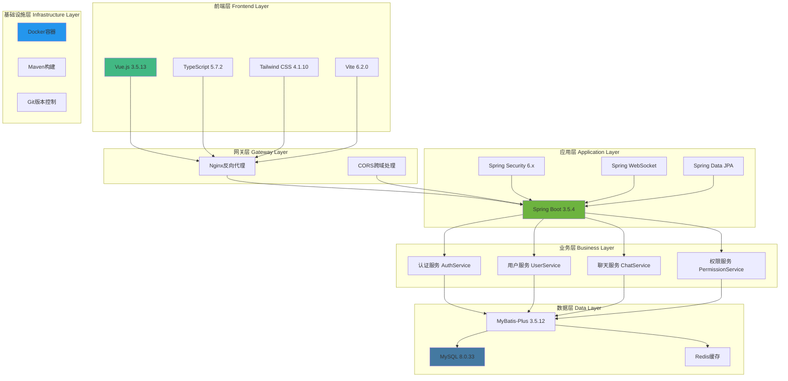

## 🔧 技术栈详解

### 后端技术栈
| 技术 | 版本 | 作用 | 核心特性 |
|------|------|------|----------|
| **Java** | 21 | 核心开发语言 | var关键字、switch表达式、文本块 |
| **Spring Boot** | 3.5.4 | 应用框架 | 自动配置、内嵌服务器、监控 |
| **Spring Security** | 6.x | 安全框架 | JWT认证、RBAC权限、方法级安全 |
| **Spring WebSocket** | 6.x | 实时通信 | STOMP协议、消息代理、会话管理 |
| **MyBatis-Plus** | 3.5.12 | ORM框架 | 代码生成、条件构造器、分页插件 |
| **MySQL** | 8.0.33 | 关系数据库 | 事务支持、索引优化、主从复制 |
| **JWT** | 0.11.5 | 令牌认证 | 无状态认证、双令牌机制、自动刷新 |
| **Lombok** | Latest | 代码简化 | 注解驱动、减少样板代码 |
| **Maven** | 3.x | 构建工具 | 依赖管理、生命周期管理 |

### 前端技术栈
| 技术 | 版本 | 作用 | 核心特性 |
|------|------|------|----------|
| **Vue.js** | 3.5.13 | 前端框架 | Composition API、响应式系统、组件化 |
| **TypeScript** | 5.7.2 | 类型系统 | 静态类型检查、智能提示、重构支持 |
| **Vite** | 6.2.0 | 构建工具 | 热更新、ES模块、快速构建 |
| **Tailwind CSS** | 4.1.10 | CSS框架 | 原子化CSS、响应式设计、暗色模式 |
| **ESLint** | 9.22.0 | 代码检查 | 代码规范、错误检测、自动修复 |
| **Prettier** | 3.5.3 | 代码格式化 | 统一格式、自动格式化 |

## 🎯 架构设计原则

### 1. 分层架构 (Layered Architecture)
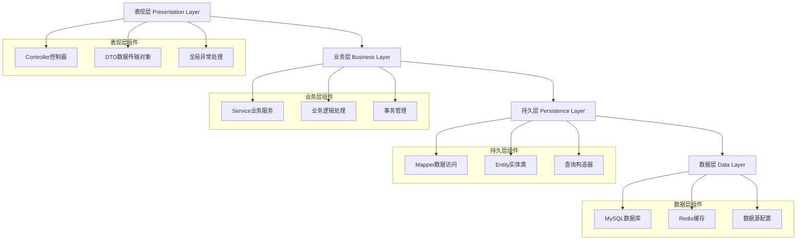

### 2. 依赖注入 (Dependency Injection)
- **构造器注入**: 使用`@RequiredArgsConstructor`替代`@Autowired`
- **接口导向**: 面向接口编程，降低耦合度
- **单一职责**: 每个组件职责明确，便于测试和维护

### 3. RESTful API设计
- **资源导向**: URL表示资源，HTTP方法表示操作
- **状态码规范**: 正确使用HTTP状态码
- **统一响应格式**: Result<T>封装所有API响应

## 🔐 安全架构设计

### JWT双令牌机制
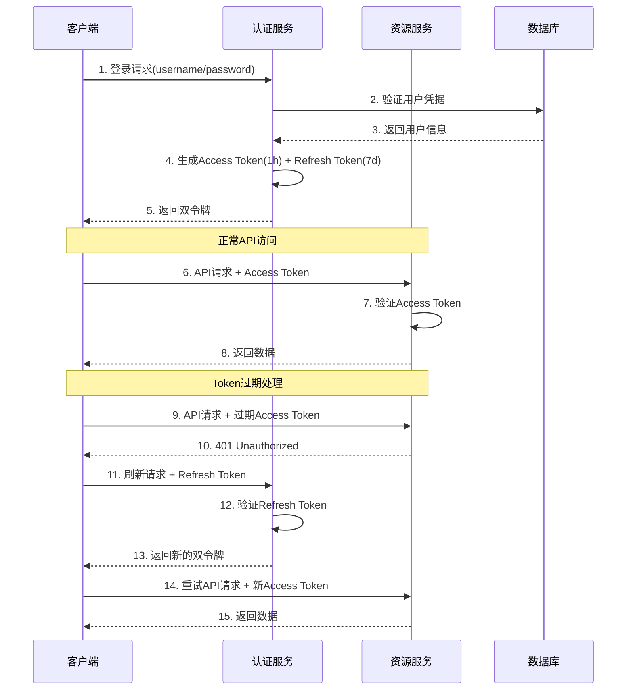

### 权限控制模型
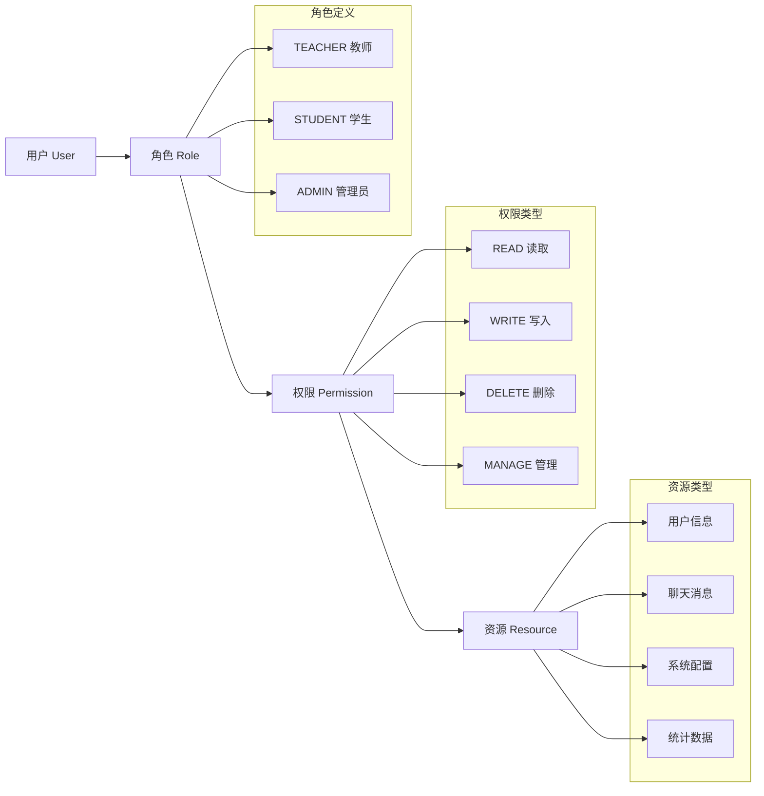

## 🗄️ 数据库设计

### 数据库架构
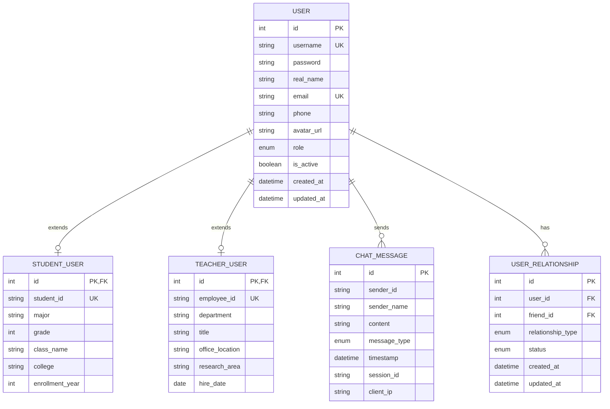

### 核心实体类设计

#### 1. 用户基类 (User.java)
```java
@Entity
@Table(name = "users")
@Inheritance(strategy = InheritanceType.JOINED)
@DiscriminatorColumn(name = "user_type", discriminatorType = DiscriminatorType.STRING)
public abstract class User {
    @Id
    @GeneratedValue(strategy = GenerationType.IDENTITY)
    private Integer id;

    @Column(unique = true, nullable = false)
    private String username;

    @Column(nullable = false)
    private String password;

    @Column(name = "real_name", nullable = false)
    private String realName;

    @Column(unique = true, nullable = false)
    private String email;

    @Enumerated(EnumType.STRING)
    @Column(nullable = false)
    private UserRole role;

    @Column(name = "is_active")
    private Boolean isActive = true;

    @CreationTimestamp
    @Column(name = "created_at")
    private LocalDateTime createdAt;

    @UpdateTimestamp
    @Column(name = "updated_at")
    private LocalDateTime updatedAt;
}
```

#### 2. 学生实体类 (StudentUser.java)
```java
@Entity
@Table(name = "student_users")
@DiscriminatorValue("STUDENT")
public class StudentUser extends User {
    @Column(name = "student_id", unique = true)
    private String studentId;

    private String major;
    private Integer grade;

    @Column(name = "class_name")
    private String className;

    private String college;

    @Column(name = "enrollment_year")
    private Integer enrollmentYear;

    // 业务方法
    public boolean isGraduated() {
        return enrollmentYear != null &&
               (Year.now().getValue() - enrollmentYear) >= 4;
    }

    public String getFullStudentInfo() {
        return String.format("%s-%s-%s级-%s",
                college, major, grade, className);
    }
}
```

#### 3. 教师实体类 (TeacherUser.java)
```java
@Entity
@Table(name = "teacher_users")
@DiscriminatorValue("TEACHER")
public class TeacherUser extends User {
    @Column(name = "employee_id", unique = true)
    private String employeeId;

    private String department;
    private String title;

    @Column(name = "office_location")
    private String officeLocation;

    @Column(name = "research_area")
    private String researchArea;

    @Column(name = "hire_date")
    private LocalDate hireDate;

    // 业务方法
    public int getWorkingYears() {
        return hireDate != null ?
               Period.between(hireDate, LocalDate.now()).getYears() : 0;
    }

    public boolean isSeniorTeacher() {
        return getWorkingYears() >= 10;
    }

    public String getFullTeacherInfo() {
        return String.format("%s-%s-%s",
                department, title, officeLocation);
    }
}
```

### 数据库配置与优化

#### 1. 连接池配置
```yaml
spring:
  datasource:
    url: jdbc:mysql://localhost:3306/social_network?useSSL=false&serverTimezone=UTC
    username: root
    password: root
    driver-class-name: com.mysql.cj.jdbc.Driver
    hikari:
      maximum-pool-size: 20
      minimum-idle: 5
      connection-timeout: 30000
      idle-timeout: 600000
      max-lifetime: 1800000
```

#### 2. MyBatis-Plus配置
```yaml
mybatis-plus:
  configuration:
    map-underscore-to-camel-case: true
    cache-enabled: true
    lazy-loading-enabled: true
    multiple-result-sets-enabled: true
  global-config:
    db-config:
      id-type: auto
      logic-delete-field: deleted
      logic-delete-value: 1
      logic-not-delete-value: 0
```

### 数据库索引策略
```sql
-- 用户表索引
CREATE INDEX idx_username ON users(username);
CREATE INDEX idx_email ON users(email);
CREATE INDEX idx_role ON users(role);
CREATE INDEX idx_created_at ON users(created_at);

-- 学生表索引
CREATE INDEX idx_student_id ON student_users(student_id);
CREATE INDEX idx_major ON student_users(major);
CREATE INDEX idx_grade ON student_users(grade);

-- 教师表索引
CREATE INDEX idx_employee_id ON teacher_users(employee_id);
CREATE INDEX idx_department ON teacher_users(department);

-- 聊天消息表索引
CREATE INDEX idx_sender_id ON chat_messages(sender_id);
CREATE INDEX idx_timestamp ON chat_messages(timestamp);
CREATE INDEX idx_session_id ON chat_messages(session_id);
```

## ⚙️ Spring Boot核心配置

### 1. 应用主类配置
```java
@SpringBootApplication
@MapperScan("xiaowu.social_network_demo.mapper")
public class SocialNetworkDemoApplication {
    public static void main(String[] args) {
        SpringApplication.run(SocialNetworkDemoApplication.class, args);
    }
}
```

### 2. Spring Security配置
```java
@Configuration
@EnableWebSecurity
@RequiredArgsConstructor
public class SecurityConfig {

    private final JwtAuthenticationFilter jwtAuthenticationFilter;

    @Bean
    public SecurityFilterChain filterChain(HttpSecurity http) throws Exception {
        return http
                .csrf(AbstractHttpConfigurer::disable)
                .authorizeHttpRequests(auth -> auth
                        // 公开接口
                        .requestMatchers("/api/auth/**", "/api/public/**", "/chat/**", "/error").permitAll()
                        // 教师专用接口
                        .requestMatchers("/api/teacher/**").hasRole("TEACHER")
                        // 学生专用接口
                        .requestMatchers("/api/student/**").hasRole("STUDENT")
                        // 需要认证的接口
                        .requestMatchers("/api/user/**").hasAnyRole("STUDENT", "TEACHER")
                        .anyRequest().authenticated()
                )
                // 禁用session，使用JWT
                .sessionManagement(session -> session.sessionCreationPolicy(SessionCreationPolicy.STATELESS))
                // 添加JWT过滤器
                .addFilterBefore(jwtAuthenticationFilter, UsernamePasswordAuthenticationFilter.class)
                // 异常处理
                .exceptionHandling(exceptions -> exceptions
                        .authenticationEntryPoint(customAuthenticationEntryPoint())
                        .accessDeniedHandler(customAccessDeniedHandler())
                )
                .build();
    }

    @Bean
    public PasswordEncoder passwordEncoder() {
        return new BCryptPasswordEncoder();
    }

    @Bean
    public AuthenticationManager authenticationManager(AuthenticationConfiguration config) throws Exception {
        return config.getAuthenticationManager();
    }
}
```

### 3. WebSocket配置
```java
@Configuration
@EnableWebSocket
@RequiredArgsConstructor
public class WebSocketConfig implements WebSocketConfigurer {

    private final ChatWebSocketHandler chatWebSocketHandler;
    private final WebSocketInterceptor webSocketInterceptor;

    @Override
    public void registerWebSocketHandlers(WebSocketHandlerRegistry registry) {
        registry
                .addHandler(chatWebSocketHandler, "/chat")
                .addInterceptors(webSocketInterceptor)
                .setAllowedOriginPatterns(
                        "http://localhost:*",
                        "http://127.0.0.1:*",
                        "http://192.168.*.*:*",
                        "https://localhost:*",
                        "https://127.0.0.1:*"
                );
    }
}
```

## 🔐 JWT认证机制深度解析

### 1. JWT工具类核心实现
```java
@Component
@RequiredArgsConstructor
public class JwtUtil {

    private final String secretKey;
    private final long accessTokenExpirationMs;
    private final long refreshTokenExpirationMs;
    private final SecretKey signingKey;

    public JwtUtil(@Value("${app.jwt.secret}") String secretKey,
                   @Value("${app.jwt.expirationMs:3600000}") long expirationMs) {
        this.secretKey = secretKey;
        this.accessTokenExpirationMs = expirationMs;
        this.refreshTokenExpirationMs = expirationMs * 24 * 7; // 7天

        // 确保密钥长度足够安全(256位)
        var keyBytes = secretKey.getBytes();
        if (keyBytes.length < 32) {
            try {
                var digest = MessageDigest.getInstance("SHA-256");
                keyBytes = digest.digest(keyBytes);
            } catch (Exception e) {
                throw new RuntimeException("无法生成安全的JWT密钥", e);
            }
        }
        this.signingKey = Keys.hmacShaKeyFor(keyBytes);
    }

    /**
     * 创建访问令牌
     */
    public String createAccessToken(String userId, String username, UserRole role) {
        var now = new Date();
        var expiryDate = new Date(now.getTime() + accessTokenExpirationMs);

        return Jwts.builder()
                .setSubject(userId)
                .claim("username", username)
                .claim("role", role.name())
                .claim("type", "access")
                .setIssuedAt(now)
                .setExpiration(expiryDate)
                .signWith(signingKey, SignatureAlgorithm.HS256)
                .compact();
    }

    /**
     * 创建刷新令牌
     */
    public String createRefreshToken(String userId) {
        var now = new Date();
        var expiryDate = new Date(now.getTime() + refreshTokenExpirationMs);

        return Jwts.builder()
                .setSubject(userId)
                .claim("type", "refresh")
                .setIssuedAt(now)
                .setExpiration(expiryDate)
                .signWith(signingKey, SignatureAlgorithm.HS256)
                .compact();
    }
}
```

### 2. JWT认证过滤器
```java
@Component
@RequiredArgsConstructor
public class JwtAuthenticationFilter extends OncePerRequestFilter {

    private final JwtUtil jwtUtil;
    private final UserDetailsService userDetailsService;

    @Override
    protected void doFilterInternal(@NonNull HttpServletRequest request,
                                  @NonNull HttpServletResponse response,
                                  @NonNull FilterChain filterChain) throws ServletException, IOException {

        var authHeader = request.getHeader("Authorization");

        if (authHeader == null || !authHeader.startsWith("Bearer ")) {
            filterChain.doFilter(request, response);
            return;
        }

        try {
            var token = jwtUtil.extractTokenFromHeader(authHeader);

            if (token != null && jwtUtil.validateToken(token) && !jwtUtil.isRefreshToken(token)) {
                var username = jwtUtil.getUsernameFromToken(token);

                if (username != null && SecurityContextHolder.getContext().getAuthentication() == null) {
                    var userDetails = userDetailsService.loadUserByUsername(username);

                    var authToken = new UsernamePasswordAuthenticationToken(
                            userDetails,
                            null,
                            userDetails.getAuthorities()
                    );

                    authToken.setDetails(new WebAuthenticationDetailsSource().buildDetails(request));
                    SecurityContextHolder.getContext().setAuthentication(authToken);
                }
            }
        } catch (Exception e) {
            log.error("JWT认证过程中发生错误: {}", e.getMessage());
            SecurityContextHolder.clearContext();
        }

        filterChain.doFilter(request, response);
    }

    @Override
    protected boolean shouldNotFilter(HttpServletRequest request) {
        var path = request.getRequestURI();
        return path.startsWith("/api/auth/") ||
               path.startsWith("/api/public/") ||
               path.startsWith("/chat/") ||
               path.equals("/error");
    }
}
```

## 🏢 业务服务层设计

### 1. 认证服务 (AuthService)
```java
@Service
@RequiredArgsConstructor
@Slf4j
public class AuthService {

    private final UserMapper userMapper;
    private final PasswordEncoder passwordEncoder;
    private final JwtUtil jwtUtil;

    /**
     * 生成登录响应
     */
    public LoginResponse generateLoginResponse(String username, UserRole userType, boolean rememberMe) {
        var user = userMapper.selectOne(
                new QueryWrapper<User>().eq("username", username)
        );

        if (user == null) {
            throw new RuntimeException("用户不存在");
        }

        // 生成令牌
        var accessToken = jwtUtil.createAccessToken(
                user.getId().toString(),
                user.getUsername(),
                user.getRole()
        );

        var refreshToken = jwtUtil.createRefreshToken(user.getId().toString());

        // 构建响应
        return LoginResponse.builder()
                .accessToken(accessToken)
                .refreshToken(refreshToken)
                .tokenType("Bearer")
                .expiresIn(3600L)
                .userId(user.getId())
                .username(user.getUsername())
                .realName(user.getRealName())
                .email(user.getEmail())
                .role(user.getRole())
                .avatarUrl(user.getAvatarUrl())
                .lastLoginTime(LocalDateTime.now())
                .department(getUserDepartment(user))
                .build();
    }

    /**
     * 学生注册
     */
    @Transactional
    public boolean registerStudent(RegisterRequest request) {
        if (isUsernameOrEmailExists(request.getUsername(), request.getEmail())) {
            return false;
        }

        var student = new StudentUser(
                request.getUsername(),
                passwordEncoder.encode(request.getPassword()),
                request.getRealName(),
                request.getEmail()
        );

        // 设置学生特有信息
        student.setStudentId(request.getStudentId());
        student.setMajor(request.getMajor());
        student.setGrade(request.getGrade());
        student.setClassName(request.getClassName());
        student.setCollege(request.getCollege());
        student.setEnrollmentYear(request.getEnrollmentYear());

        return userMapper.insert(student) > 0;
    }

    /**
     * 教师注册
     */
    @Transactional
    public boolean registerTeacher(RegisterRequest request) {
        if (isUsernameOrEmailExists(request.getUsername(), request.getEmail())) {
            return false;
        }

        var teacher = new TeacherUser(
                request.getUsername(),
                passwordEncoder.encode(request.getPassword()),
                request.getRealName(),
                request.getEmail()
        );

        // 设置教师特有信息
        teacher.setEmployeeId(request.getEmployeeId());
        teacher.setDepartment(request.getDepartment());
        teacher.setTitle(request.getTitle());
        teacher.setOfficeLocation(request.getOfficeLocation());
        teacher.setResearchArea(request.getResearchArea());
        teacher.setHireDate(LocalDate.now());

        return userMapper.insert(teacher) > 0;
    }
}
```

### 2. 用户服务 (UserService)
```java
@Service
@RequiredArgsConstructor
@Slf4j
public class UserServiceImpl implements UserService {

    private final UserMapper userMapper;
    private final PasswordEncoder passwordEncoder;

    @Override
    public UserInfoResponse getUserInfo(String username) {
        var user = userMapper.selectOne(
                new QueryWrapper<User>().eq("username", username)
        );

        if (user == null) {
            throw new RuntimeException("用户不存在");
        }

        return convertToUserInfoResponse(user);
    }

    @Override
    @Transactional
    public boolean updateUserInfo(String username, UserInfoResponse updateRequest) {
        var user = userMapper.selectOne(
                new QueryWrapper<User>().eq("username", username)
        );

        if (user == null) {
            return false;
        }

        // 更新基本信息
        user.setRealName(updateRequest.getRealName());
        user.setEmail(updateRequest.getEmail());
        user.setPhone(updateRequest.getPhone());
        user.setUpdatedAt(LocalDateTime.now());

        // 根据用户类型更新特定信息
        updateRoleSpecificInfo(user, updateRequest);

        return userMapper.updateById(user) > 0;
    }

    @Override
    @Transactional
    public boolean changePassword(String username, String oldPassword, String newPassword) {
        var user = userMapper.selectOne(
                new QueryWrapper<User>().eq("username", username)
        );

        if (user == null || !passwordEncoder.matches(oldPassword, user.getPassword())) {
            return false;
        }

        user.setPassword(passwordEncoder.encode(newPassword));
        user.setUpdatedAt(LocalDateTime.now());

        return userMapper.updateById(user) > 0;
    }
}
```

## 🎮 控制器层设计

### 1. 认证控制器 (AuthController)
```java
@RestController
@RequestMapping("/api/auth")
@RequiredArgsConstructor
@Slf4j
public class AuthController {

    private final AuthenticationManager authenticationManager;
    private final AuthService authService;
    private final JwtUtil jwtUtil;

    /**
     * 用户登录
     */
    @PostMapping("/login")
    public Result<LoginResponse> login(@Valid @RequestBody LoginRequest request) {
        try {
            log.info("用户登录尝试: {}, 类型: {}", request.getUsername(), request.getUserType());

            // Spring Security 认证
            var authToken = new UsernamePasswordAuthenticationToken(
                    request.getUsername(),
                    request.getPassword()
            );

            Authentication authentication = authenticationManager.authenticate(authToken);

            // 生成登录响应
            var loginResponse = authService.generateLoginResponse(
                    request.getUsername(),
                    request.getUserType(),
                    request.isRememberMe()
            );

            log.info("用户 {} 登录成功", request.getUsername());
            return Result.success("登录成功", loginResponse);

        } catch (AuthenticationException e) {
            log.warn("用户 {} 登录失败: {}", request.getUsername(), e.getMessage());
            return Result.unauthorized("用户名或密码错误");
        } catch (Exception e) {
            log.error("登录过程中发生错误", e);
            return Result.error("登录失败，请稍后重试");
        }
    }

    /**
     * 学生注册
     */
    @PostMapping("/register/student")
    public Result<String> registerStudent(@Valid @RequestBody RegisterRequest request) {
        try {
            if (!request.getPassword().equals(request.getConfirmPassword())) {
                return Result.badRequest("两次输入的密码不一致");
            }

            var result = authService.registerStudent(request);

            if (result) {
                log.info("学生 {} 注册成功", request.getUsername());
                return Result.success("注册成功，请登录");
            } else {
                return Result.error("注册失败，用户名或邮箱已存在");
            }

        } catch (Exception e) {
            log.error("学生注册过程中发生错误", e);
            return Result.error("注册失败，请稍后重试");
        }
    }

    /**
     * 刷新令牌
     */
    @PostMapping("/refresh")
    public Result<LoginResponse> refreshToken(@RequestHeader("Authorization") String authHeader) {
        try {
            var refreshToken = jwtUtil.extractTokenFromHeader(authHeader);

            if (refreshToken == null || !jwtUtil.isRefreshToken(refreshToken)) {
                return Result.unauthorized("无效的刷新令牌");
            }

            if (!jwtUtil.validateToken(refreshToken)) {
                return Result.unauthorized("刷新令牌已过期");
            }

            var userId = jwtUtil.getUserIdFromToken(refreshToken);
            var newTokens = authService.refreshTokens(userId);

            return Result.success("令牌刷新成功", newTokens);

        } catch (Exception e) {
            log.error("刷新令牌过程中发生错误", e);
            return Result.unauthorized("令牌刷新失败");
        }
    }
}
```

## 🔄 WebSocket实时通信技术深度解析

### WebSocket协议原理
WebSocket是一种在单个TCP连接上进行全双工通信的协议。与传统HTTP请求-响应模式不同，WebSocket允许服务器主动向客户端推送数据。

#### 核心特性：
- **全双工通信**: 客户端和服务器可以同时发送数据
- **低延迟**: 避免了HTTP的请求头开销
- **持久连接**: 连接建立后保持开放状态
- **跨域支持**: 通过握手协议支持跨域通信

#### 连接建立过程：
1. **HTTP握手**: 客户端发送Upgrade请求
2. **协议升级**: 服务器返回101状态码
3. **连接建立**: 切换到WebSocket协议
4. **数据传输**: 开始全双工通信

### Spring WebSocket架构原理

#### 1. 核心组件解析
- **WebSocketHandler**: 处理WebSocket生命周期事件
- **WebSocketInterceptor**: 拦截器，用于连接前后的处理
- **WebSocketSession**: 代表一个WebSocket连接会话
- **MessageRouter**: 自定义消息路由器，负责消息分发

#### 2. 消息处理机制
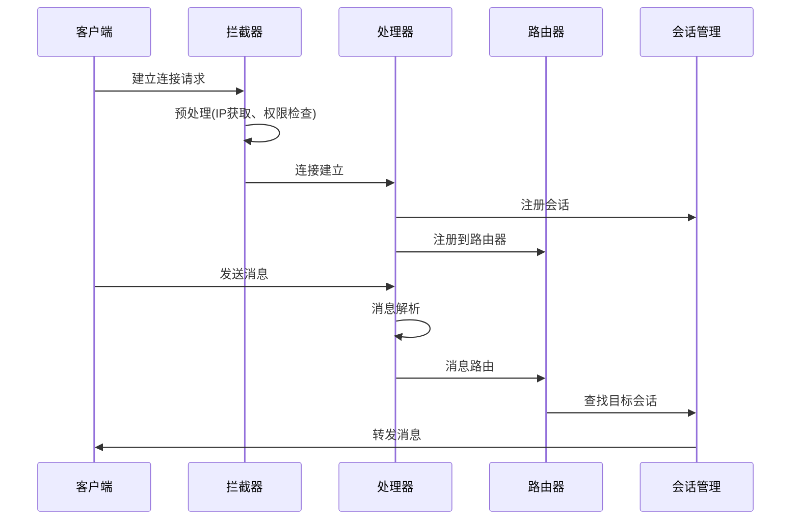

#### 3. 会话管理策略
- **会话存储**: 使用ConcurrentHashMap存储活跃会话
- **用户映射**: SessionId与用户信息的映射关系
- **连接保活**: 心跳机制防止连接超时
- **异常处理**: 连接异常时的清理和恢复机制

#### 4. WebSocket八股文知识点

**Q: WebSocket与HTTP的区别？**
A:
- **协议层面**: HTTP是无状态的请求-响应协议，WebSocket是有状态的全双工协议
- **连接方式**: HTTP每次请求都需要建立连接，WebSocket建立一次连接后持续使用
- **数据传输**: HTTP只能客户端主动请求，WebSocket支持双向主动推送
- **开销**: WebSocket避免了HTTP头部开销，传输效率更高

**Q: WebSocket的握手过程？**
A:
1. 客户端发送HTTP请求，包含`Upgrade: websocket`头
2. 服务器验证请求，返回101状态码
3. 双方切换到WebSocket协议
4. 开始WebSocket数据帧传输

**Q: 如何保证WebSocket连接的可靠性？**
A:
- **心跳机制**: 定期发送ping/pong帧检测连接状态
- **重连机制**: 连接断开时自动重连
- **消息确认**: 重要消息需要确认机制
- **异常处理**: 完善的异常捕获和处理逻辑

## 🔐 JWT认证机制深度剖析

### JWT结构解析
JWT由三部分组成，用点号分隔：`Header.Payload.Signature`

#### 1. Header（头部）
```json
{
  "alg": "HS256",
  "typ": "JWT"
}
```
- **alg**: 签名算法，如HMAC SHA256
- **typ**: 令牌类型，固定为JWT

#### 2. Payload（载荷）
```json
{
  "sub": "1234567890",
  "username": "john_doe",
  "role": "TEACHER",
  "iat": 1516239022,
  "exp": 1516242622
}
```
- **sub**: 主题，通常是用户ID
- **iat**: 签发时间
- **exp**: 过期时间
- **自定义声明**: 用户名、角色等业务信息

#### 3. Signature（签名）
```
HMACSHA256(
  base64UrlEncode(header) + "." +
  base64UrlEncode(payload),
  secret
)
```

### 双令牌机制原理

#### 设计思想
- **Access Token**: 短期有效(1小时)，用于API访问
- **Refresh Token**: 长期有效(7天)，用于刷新Access Token
- **安全隔离**: 不同令牌承担不同职责，降低安全风险

#### 令牌刷新流程
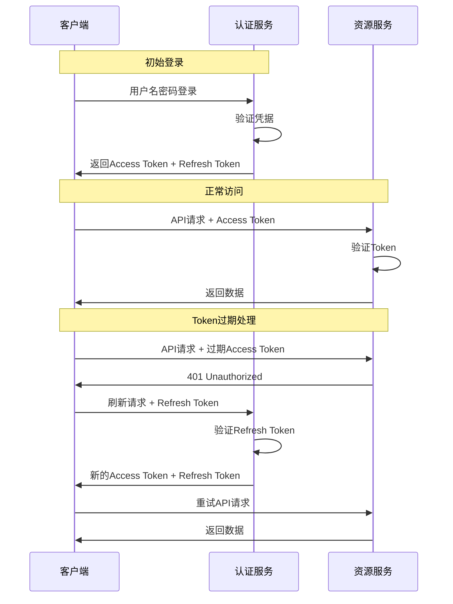

### JWT安全考虑

#### 1. 密钥安全
- **密钥长度**: 至少256位(32字节)
- **密钥存储**: 环境变量或配置中心
- **密钥轮换**: 定期更换签名密钥

#### 2. 令牌安全
- **HTTPS传输**: 防止令牌被截获
- **安全存储**: 客户端安全存储令牌
- **过期时间**: 合理设置令牌有效期
- **黑名单机制**: 支持令牌撤销

### JWT八股文知识点

**Q: JWT与Session的区别？**
A:
- **存储位置**: Session存储在服务器，JWT存储在客户端
- **扩展性**: JWT支持分布式，Session需要共享存储
- **安全性**: Session相对更安全，JWT需要防止XSS攻击
- **性能**: JWT减少服务器存储压力，但增加网络传输开销

**Q: JWT的优缺点？**
A:
优点：
- 无状态，支持分布式
- 跨域友好
- 减少服务器存储压力
- 支持移动端

缺点：
- 令牌较大，增加网络开销
- 无法主动失效
- 敏感信息不能存储在payload中

**Q: 如何防止JWT被盗用？**
A:
- 使用HTTPS传输
- 设置合理的过期时间
- 实现令牌刷新机制
- 添加设备指纹验证
- 监控异常登录行为

## 🏗️ Spring Boot自动配置原理

### 自动配置机制
Spring Boot通过`@EnableAutoConfiguration`注解启用自动配置，核心原理：

#### 1. 条件注解系统
- **@ConditionalOnClass**: 类路径存在指定类时生效
- **@ConditionalOnMissingBean**: 容器中不存在指定Bean时生效
- **@ConditionalOnProperty**: 配置属性满足条件时生效
- **@ConditionalOnWebApplication**: Web应用环境下生效

#### 2. 配置类加载过程
```mermaid
graph TD
    A[SpringApplication.run] --> B[加载主配置类]
    B --> C[@EnableAutoConfiguration]
    C --> D[扫描META-INF/spring.factories]
    D --> E[加载自动配置类]
    E --> F[条件注解评估]
    F --> G[创建Bean实例]
    G --> H[依赖注入]
    H --> I[应用启动完成]
```

#### 3. 核心自动配置类
- **WebMvcAutoConfiguration**: Web MVC配置
- **SecurityAutoConfiguration**: 安全配置
- **DataSourceAutoConfiguration**: 数据源配置
- **JpaRepositoriesAutoConfiguration**: JPA仓库配置

### Spring Boot启动流程

#### 1. 启动过程详解
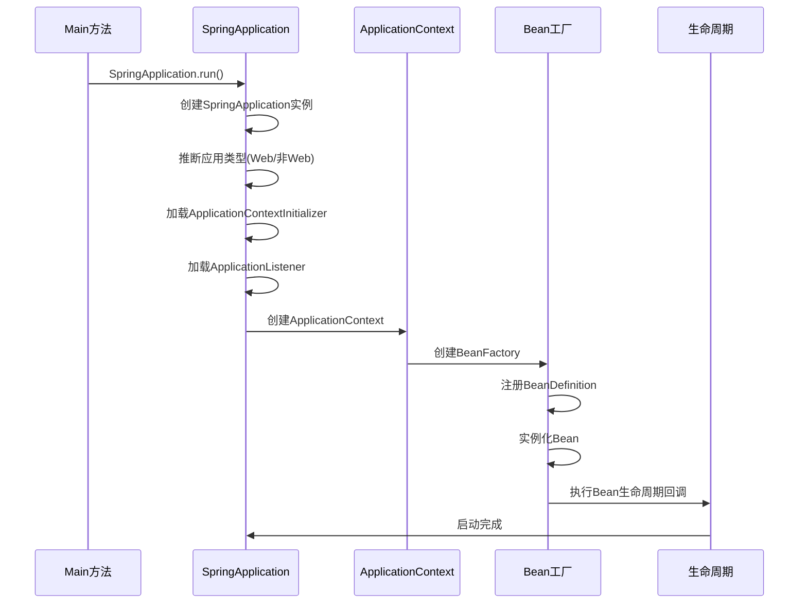

#### 2. Bean生命周期
- **实例化**: 调用构造函数创建Bean实例
- **属性注入**: 设置Bean的属性值
- **初始化前**: 调用BeanPostProcessor的前置处理
- **初始化**: 调用InitializingBean或@PostConstruct方法
- **初始化后**: 调用BeanPostProcessor的后置处理
- **使用**: Bean可以被使用
- **销毁**: 调用DisposableBean或@PreDestroy方法

### Spring Boot八股文知识点

**Q: Spring Boot的核心特性？**
A:
- **自动配置**: 根据类路径自动配置Spring应用
- **起步依赖**: 简化Maven/Gradle依赖管理
- **内嵌服务器**: 内置Tomcat/Jetty/Undertow
- **生产就绪**: 提供监控、健康检查等功能
- **无代码生成**: 不生成代码，不需要XML配置

**Q: @SpringBootApplication注解的作用？**
A: 这是一个组合注解，包含：
- **@SpringBootConfiguration**: 标识配置类
- **@EnableAutoConfiguration**: 启用自动配置
- **@ComponentScan**: 启用组件扫描

**Q: Spring Boot如何实现零配置？**
A:
- **约定优于配置**: 提供合理的默认配置
- **条件注解**: 根据环境自动决定是否生效
- **自动配置类**: 预定义的配置类自动生效
- **配置属性**: 通过application.properties/yml外部化配置

## 🛡️ Spring Security安全框架原理

### Spring Security工作原理

#### 1. 过滤器链机制
Spring Security基于Servlet过滤器链实现安全控制：

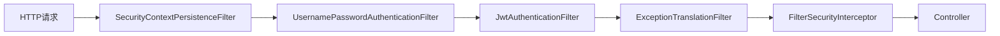

#### 2. 核心组件
- **SecurityFilterChain**: 安全过滤器链配置
- **AuthenticationManager**: 认证管理器
- **AuthenticationProvider**: 认证提供者
- **UserDetailsService**: 用户详情服务
- **PasswordEncoder**: 密码编码器
- **AccessDecisionManager**: 访问决策管理器

#### 3. 认证流程
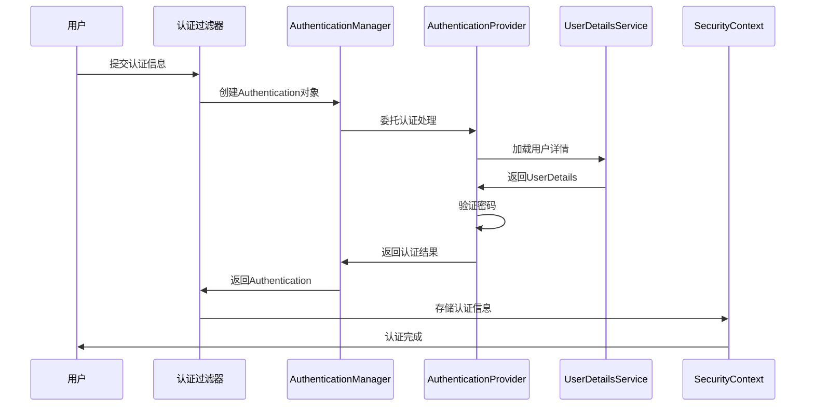

#### 4. 授权机制
- **基于URL的授权**: 通过antMatchers()配置URL访问权限
- **基于方法的授权**: 使用@PreAuthorize、@PostAuthorize注解
- **基于表达式的授权**: 支持SpEL表达式进行复杂授权判断

### RBAC权限模型

#### 1. 角色权限设计
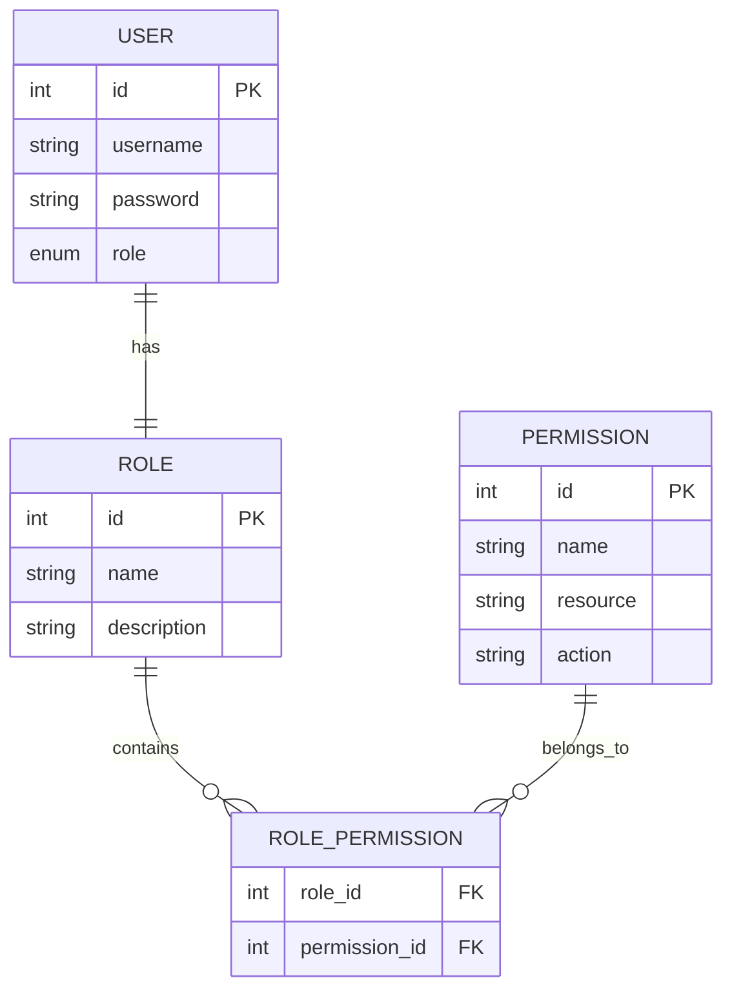

#### 2. 权限控制策略
- **角色继承**: 支持角色层次结构
- **权限组合**: 支持多权限组合判断
- **动态权限**: 支持运行时权限变更
- **细粒度控制**: 支持方法级、字段级权限控制

### Spring Security八股文知识点

**Q: Spring Security的核心概念？**
A:
- **Authentication**: 认证，验证用户身份
- **Authorization**: 授权，验证用户权限
- **Principal**: 主体，当前用户
- **Authorities**: 权限集合
- **SecurityContext**: 安全上下文，存储认证信息

**Q: Spring Security如何防止CSRF攻击？**
A:
- **CSRF Token**: 生成随机令牌验证请求合法性
- **同源检查**: 验证请求来源
- **双重提交**: 同时在表单和Cookie中提交令牌
- **SameSite Cookie**: 设置Cookie的SameSite属性

**Q: 如何自定义认证流程？**
A:
- 实现UserDetailsService接口
- 自定义AuthenticationProvider
- 配置自定义的认证过滤器
- 重写configure(AuthenticationManagerBuilder)方法

## 📊 MyBatis-Plus ORM框架原理

### MyBatis-Plus核心特性

#### 1. 代码生成器原理
- **模板引擎**: 使用Velocity/Freemarker模板生成代码
- **数据库元数据**: 通过JDBC读取表结构信息
- **命名策略**: 支持驼峰、下划线等命名转换
- **自定义模板**: 支持自定义代码生成模板

#### 2. 条件构造器
```java
// 核心API示例
QueryWrapper<User> wrapper = new QueryWrapper<>();
wrapper.lambda()
    .eq(User::getUsername, "john")          // 等于
    .ne(User::getStatus, 0)                 // 不等于
    .gt(User::getAge, 18)                   // 大于
    .like(User::getName, "张")               // 模糊查询
    .between(User::getAge, 18, 65)          // 区间查询
    .orderByDesc(User::getCreatedAt);       // 排序
```

#### 3. 分页插件原理
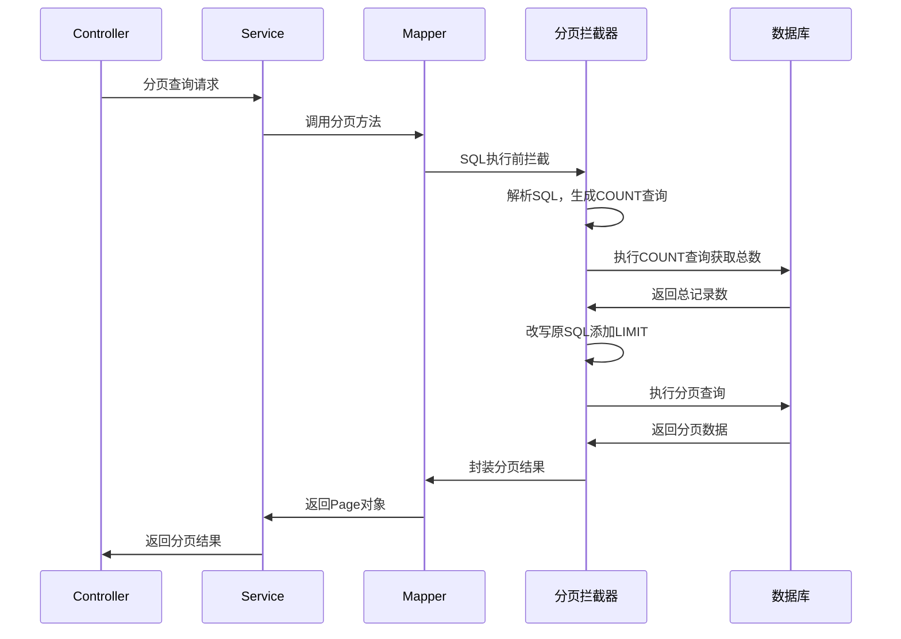

### 数据库连接池原理

#### 1. HikariCP连接池
- **连接池管理**: 维护数据库连接的生命周期
- **连接复用**: 避免频繁创建销毁连接的开销
- **连接验证**: 定期检查连接有效性
- **性能优化**: 使用FastList、ConcurrentBag等高性能数据结构

#### 2. 连接池配置参数
```yaml
spring:
  datasource:
    hikari:
      maximum-pool-size: 20        # 最大连接数
      minimum-idle: 5              # 最小空闲连接数
      connection-timeout: 30000    # 连接超时时间
      idle-timeout: 600000         # 空闲超时时间
      max-lifetime: 1800000        # 连接最大生存时间
      leak-detection-threshold: 60000  # 连接泄漏检测阈值
```

### 事务管理原理

#### 1. Spring事务管理
```mermaid
graph TD
    A[@Transactional注解] --> B[AOP代理]
    B --> C[TransactionInterceptor]
    C --> D[PlatformTransactionManager]
    D --> E[开启事务]
    E --> F[执行业务方法]
    F --> G{方法执行结果}
    G -->|成功| H[提交事务]
    G -->|异常| I[回滚事务]
    H --> J[释放连接]
    I --> J
```

#### 2. 事务传播机制
- **REQUIRED**: 如果存在事务则加入，否则创建新事务
- **REQUIRES_NEW**: 总是创建新事务，挂起当前事务
- **SUPPORTS**: 如果存在事务则加入，否则以非事务方式执行
- **NOT_SUPPORTED**: 以非事务方式执行，挂起当前事务
- **MANDATORY**: 必须在事务中执行，否则抛出异常
- **NEVER**: 不能在事务中执行，否则抛出异常
- **NESTED**: 嵌套事务，使用保存点实现

### MyBatis-Plus八股文知识点

**Q: MyBatis和MyBatis-Plus的区别？**
A:
- **代码生成**: MP提供强大的代码生成器
- **CRUD操作**: MP提供通用的CRUD接口
- **条件构造**: MP提供Lambda条件构造器
- **分页插件**: MP内置分页插件
- **性能分析**: MP提供SQL性能分析功能

**Q: MyBatis的一级缓存和二级缓存？**
A:
- **一级缓存**: SqlSession级别，默认开启，生命周期与SqlSession相同
- **二级缓存**: Mapper级别，需要手动开启，可以跨SqlSession共享
- **缓存失效**: 执行增删改操作时缓存会被清空
- **缓存配置**: 可以通过@CacheNamespace注解配置二级缓存

**Q: 如何防止SQL注入？**
A:
- **参数化查询**: 使用#{}而不是${}
- **输入验证**: 验证用户输入的合法性
- **权限控制**: 限制数据库用户权限
- **预编译语句**: 使用PreparedStatement

## 🚀 性能优化策略

### 数据库优化

#### 1. 索引优化
- **主键索引**: 聚簇索引，数据按主键顺序存储
- **唯一索引**: 保证数据唯一性，提高查询效率
- **复合索引**: 多列组合索引，注意最左前缀原则
- **覆盖索引**: 索引包含查询所需的所有列

#### 2. SQL优化
- **避免全表扫描**: 合理使用WHERE条件
- **优化JOIN查询**: 选择合适的JOIN类型
- **分页优化**: 使用LIMIT优化大数据量分页
- **子查询优化**: 将子查询改写为JOIN

#### 3. 连接池优化
- **合理设置连接数**: 根据并发量调整连接池大小
- **连接验证**: 定期检查连接有效性
- **连接超时**: 设置合理的超时时间
- **监控告警**: 监控连接池使用情况

### JVM优化

#### 1. 内存调优
- **堆内存设置**: -Xms和-Xmx设置合理的堆大小
- **新生代配置**: -Xmn设置新生代大小
- **元空间设置**: -XX:MetaspaceSize设置元空间大小
- **GC算法选择**: 根据应用特点选择合适的GC算法

#### 2. GC优化
- **G1GC**: 适合大堆内存，低延迟要求
- **ZGC**: 超低延迟垃圾收集器
- **并发标记**: 减少STW时间
- **GC监控**: 监控GC频率和耗时

## 📈 监控与运维

### Spring Boot Actuator

#### 1. 健康检查
- **Health Endpoint**: /actuator/health
- **自定义健康指示器**: 实现HealthIndicator接口
- **数据库健康检查**: 检查数据库连接状态
- **外部服务检查**: 检查依赖服务状态

#### 2. 指标监控
- **Metrics Endpoint**: /actuator/metrics
- **JVM指标**: 内存、GC、线程等指标
- **HTTP指标**: 请求数量、响应时间等
- **自定义指标**: 业务相关的自定义指标

#### 3. 日志管理
- **Logback配置**: 灵活的日志配置
- **日志级别**: 动态调整日志级别
- **日志聚合**: 集中收集和分析日志
- **链路追踪**: 分布式系统的请求追踪

### WebSocket八股文知识点

**Q: WebSocket与HTTP的区别？**
A:
- **协议层面**: HTTP是无状态的请求-响应协议，WebSocket是有状态的全双工协议
- **连接方式**: HTTP每次请求都需要建立连接，WebSocket建立一次连接后持续使用
- **数据传输**: HTTP只能客户端主动请求，WebSocket支持双向主动推送
- **开销**: WebSocket避免了HTTP头部开销，传输效率更高

**Q: WebSocket的握手过程？**
A:
1. 客户端发送HTTP请求，包含`Upgrade: websocket`头
2. 服务器验证请求，返回101状态码
3. 双方切换到WebSocket协议
4. 开始WebSocket数据帧传输

**Q: 如何保证WebSocket连接的可靠性？**
A:
- **心跳机制**: 定期发送ping/pong帧检测连接状态
- **重连机制**: 连接断开时自动重连
- **消息确认**: 重要消息需要确认机制
- **异常处理**: 完善的异常捕获和处理逻辑

### JWT八股文知识点

**Q: JWT与Session的区别？**
A:
- **存储位置**: Session存储在服务器，JWT存储在客户端
- **扩展性**: JWT支持分布式，Session需要共享存储
- **安全性**: Session相对更安全，JWT需要防止XSS攻击
- **性能**: JWT减少服务器存储压力，但增加网络传输开销

**Q: JWT的优缺点？**
A:
优点：
- 无状态，支持分布式
- 跨域友好
- 减少服务器存储压力
- 支持移动端

缺点：
- 令牌较大，增加网络开销
- 无法主动失效
- 敏感信息不能存储在payload中

**Q: 如何防止JWT被盗用？**
A:
- 使用HTTPS传输
- 设置合理的过期时间
- 实现令牌刷新机制
- 添加设备指纹验证
- 监控异常登录行为

### Spring Boot八股文知识点

**Q: Spring Boot的核心特性？**
A:
- **自动配置**: 根据类路径自动配置Spring应用
- **起步依赖**: 简化Maven/Gradle依赖管理
- **内嵌服务器**: 内置Tomcat/Jetty/Undertow
- **生产就绪**: 提供监控、健康检查等功能
- **无代码生成**: 不生成代码，不需要XML配置

**Q: @SpringBootApplication注解的作用？**
A: 这是一个组合注解，包含：
- **@SpringBootConfiguration**: 标识配置类
- **@EnableAutoConfiguration**: 启用自动配置
- **@ComponentScan**: 启用组件扫描

**Q: Spring Boot如何实现零配置？**
A:
- **约定优于配置**: 提供合理的默认配置
- **条件注解**: 根据环境自动决定是否生效
- **自动配置类**: 预定义的配置类自动生效
- **配置属性**: 通过application.properties/yml外部化配置

### Spring Security八股文知识点

**Q: Spring Security的核心概念？**
A:
- **Authentication**: 认证，验证用户身份
- **Authorization**: 授权，验证用户权限
- **Principal**: 主体，当前用户
- **Authorities**: 权限集合
- **SecurityContext**: 安全上下文，存储认证信息

**Q: Spring Security如何防止CSRF攻击？**
A:
- **CSRF Token**: 生成随机令牌验证请求合法性
- **同源检查**: 验证请求来源
- **双重提交**: 同时在表单和Cookie中提交令牌
- **SameSite Cookie**: 设置Cookie的SameSite属性

**Q: 如何自定义认证流程？**
A:
- 实现UserDetailsService接口
- 自定义AuthenticationProvider
- 配置自定义的认证过滤器
- 重写configure(AuthenticationManagerBuilder)方法

### MyBatis-Plus八股文知识点

**Q: MyBatis和MyBatis-Plus的区别？**
A:
- **代码生成**: MP提供强大的代码生成器
- **CRUD操作**: MP提供通用的CRUD接口
- **条件构造**: MP提供Lambda条件构造器
- **分页插件**: MP内置分页插件
- **性能分析**: MP提供SQL性能分析功能

**Q: MyBatis的一级缓存和二级缓存？**
A:
- **一级缓存**: SqlSession级别，默认开启，生命周期与SqlSession相同
- **二级缓存**: Mapper级别，需要手动开启，可以跨SqlSession共享
- **缓存失效**: 执行增删改操作时缓存会被清空
- **缓存配置**: 可以通过@CacheNamespace注解配置二级缓存

**Q: 如何防止SQL注入？**
A:
- **参数化查询**: 使用#{}而不是${}
- **输入验证**: 验证用户输入的合法性
- **权限控制**: 限制数据库用户权限
- **预编译语句**: 使用PreparedStatement

## 📈 总结

这份技术文档涵盖了社交网络演示系统的核心技术栈、架构设计、底层原理和面试八股文知识点，包括：

1. **系统架构**: 分层架构设计和技术选型
2. **数据库设计**: 实体关系模型和索引优化
3. **安全认证**: JWT双令牌机制和Spring Security
4. **实时通信**: WebSocket协议和消息路由
5. **框架原理**: Spring Boot自动配置和MyBatis-Plus ORM
6. **性能优化**: 数据库优化、JVM调优和监控运维

为深入理解后端技术和面试准备提供了全面的技术支撑。
